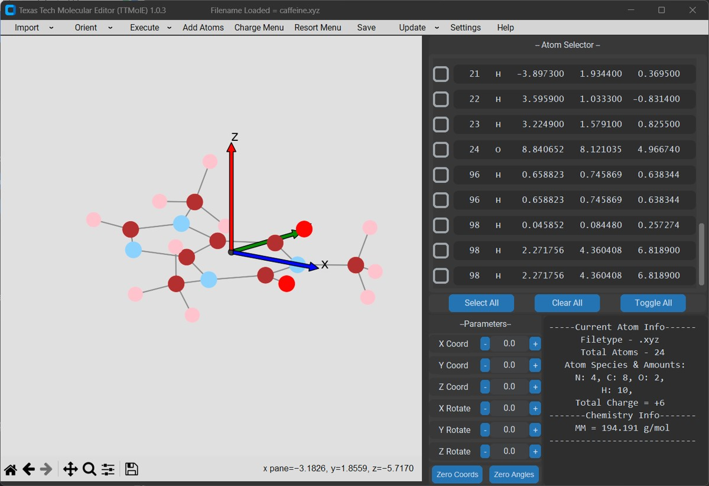

[:fontawesome-solid-house:](../index.md) :fontawesome-solid-angle-right: [Guides](index.md) :fontawesome-solid-angle-right: **Create Stack**
# Instructions on how to create a stack in TTMolE

1. Import molecule you want to create a stack of. 

    Notice for this example of caffenine, the molecule is in the x-y plane so the axis that is normal to the molecule is the z axis. This will be the axis we will want to build the stack in.

    

2. Open Import - From File Append

3. Change Absorbent settings.

    

    What Absorbent Menu Settings should be:

    1. Direction you want to add the stack into.

    2. Axis needs to be the axis you want to stack on (aka the axis normal to the molecule)

    3. Distance you want the stack to be.

    4. Centroid

    5. Centroid

4. Press Add molecule button and open up the same file. 

    We have now created a caffenine stack.

    