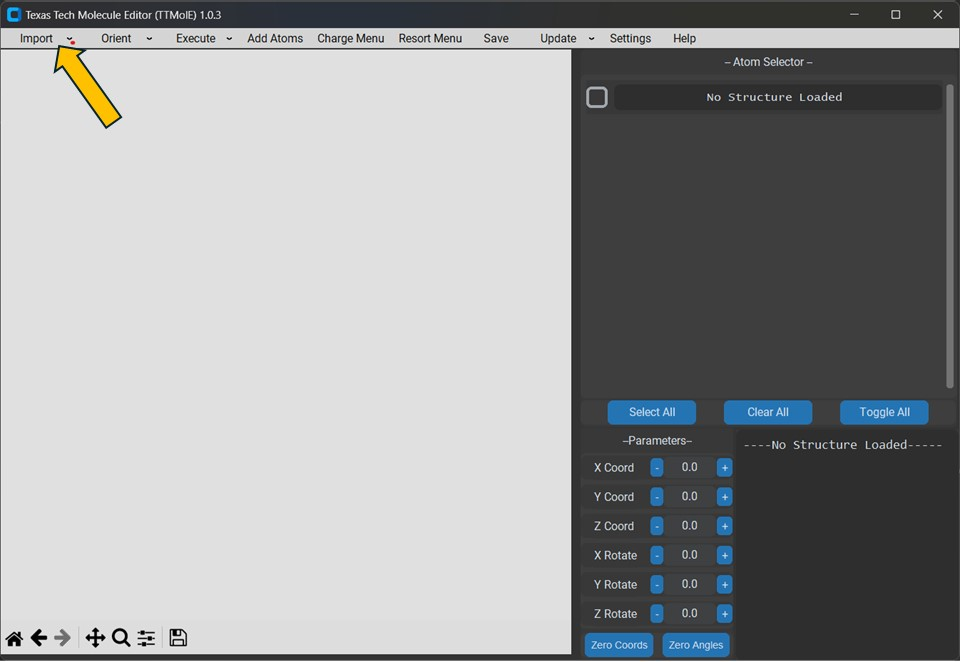
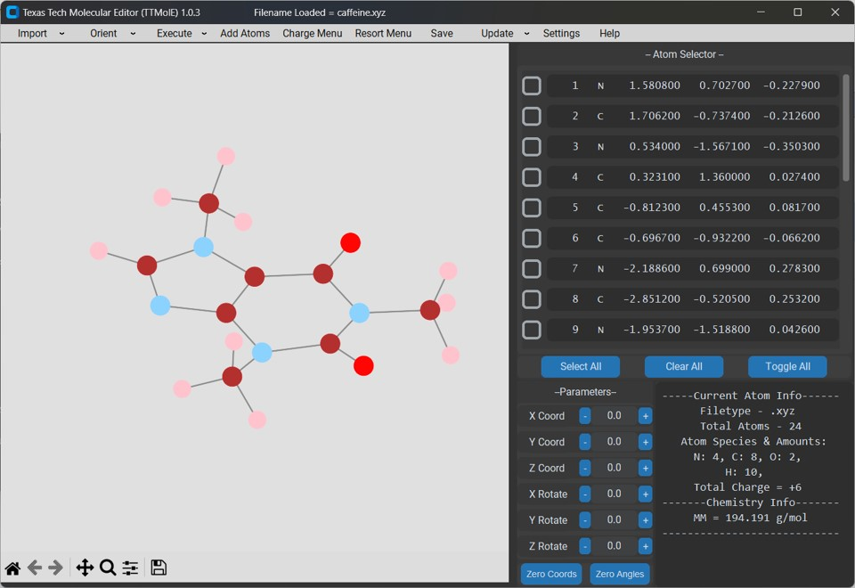

# First Steps on TTMolE

### 1. Hover mouse over `Import` Button.

### 2. Click on dropdown button `From File (New)`.

### 3. Choose a molecular file using the pop up file dialog. 
#### Currently it will read file formats:
- .xyz
- .vasp (POSCAR)
- .fdf (Quantum Espresso)
- .turbomole (Turbomole coord file)
- .xsf (Siesta input deck)
- File formats that are coming Soon:
    - .lammps
    - .cif
    - any others? please email me

{ height = 10 }
### 4. Look at imported molecular model! This example is a caffenine molecule. 
