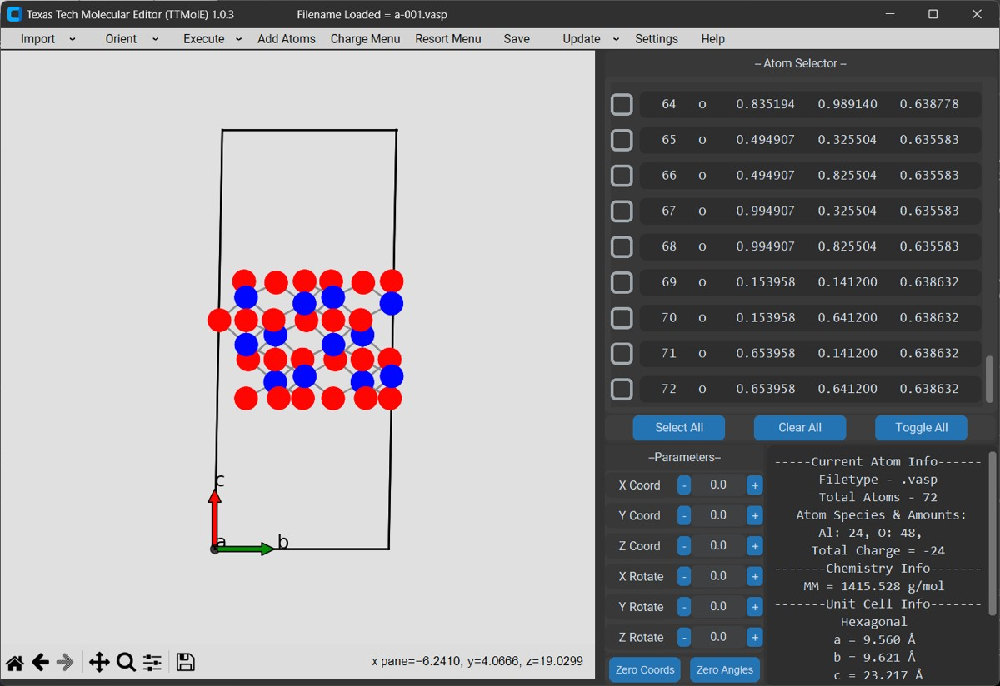
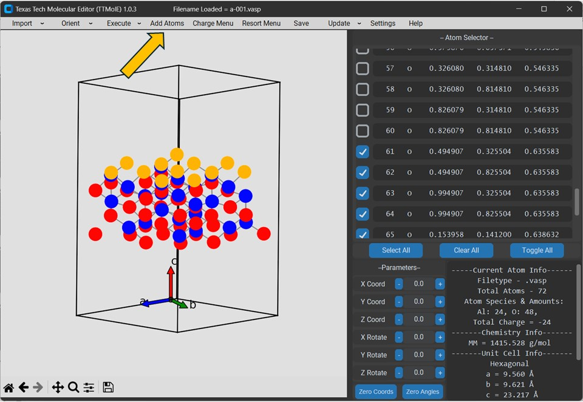
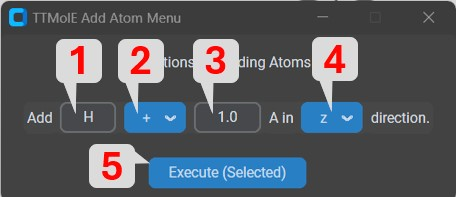
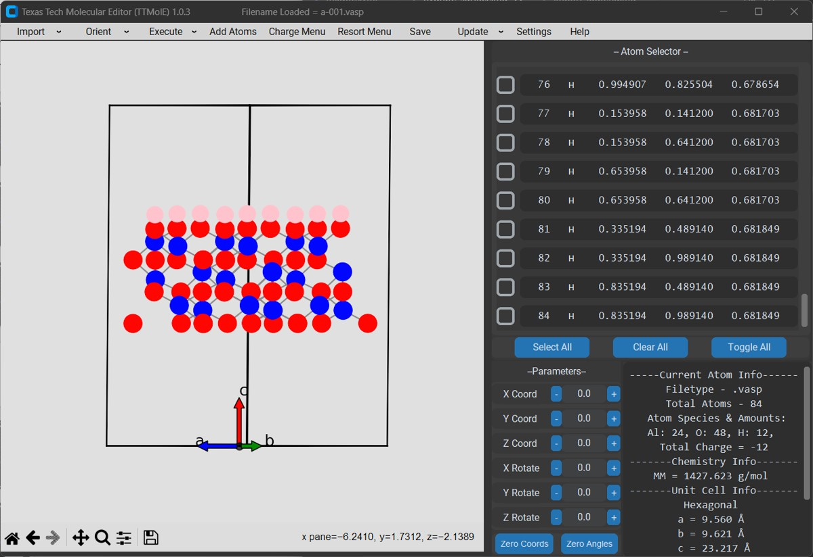
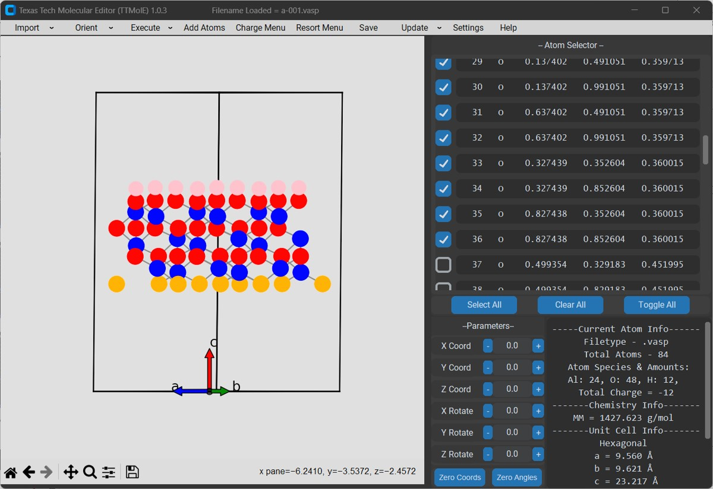

# How to Hydrate a Surface

### 1. Import your unhydrated surface or create it.

### 2. Using the checkboxes in the atom selector, check all of the surface oxygens on one face of the model. The arrow is pointing to the checkbox in the Atom Selector.

### 3. Open the Add Atom Menu.

### 4. Change settings for what you want. For this example we want to add H + 1.0 Amgstrom in the z axis.

Options for Add Atom Menu:

1. Species Dialog Box. Type what species of the atom you want to add is.

2. Direction Dropdown box. Options are '+' and '-'

3. Distance Dialog Box. Enter in the distance you want inbetween the selected atom and the new atom you are adding

4. Axis dropdown box. Options are 'x','y' or 'z'. This is what axial direction you want to add the new atom in reference to the selected atom.

5. Execute Button. By pressing this button, the atoms will be added by the settings in the menu to every atom that is selected in the editor.

### 5. Repeat for the bottom surface.

### 6. Structure is ready to be optimized. Notice in the bottom right info panel that the Total Charge is now zero which is what we want.

